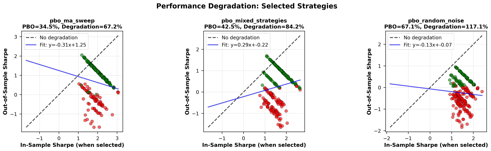

# Probability of Backtest Overfitting (PBO)

**A Project in Detecting selection bias in quantitative trading strategy optimization**

This repository implements the **Probability of Backtest Overfitting (PBO)** framework introduced by **Bailey, Borwein & López de Prado (2014)**. The goal is to rigorously quantify _selection bias_ that arises when traders optimize across many strategies or parameters and then deploy the single best backtest.

> **Core question:** > _If I optimize over many strategies and pick the best backtest, what is the probability it fails on new data?_

---



*In-sample vs out-of-sample Sharpe ratios for selected strategies.  
Points below the diagonal indicate performance degradation due to selection bias.*

---

---

## Why This Matters

Most algorithmic trading strategies fail **not because the underlying idea is wrong**, but because the _selection process is biased_.

A common workflow looks like this:

1. Test dozens or hundreds of parameter configurations
2. Select the configuration with the highest backtest Sharpe
3. Trade that strategy live

**The problem:** the selected strategy is often the _luckiest realisation_, not the most robust one. This phenomenon—sometimes called the _winner’s curse_—leads to severe degradation in live performance and has cost hedge funds millions.

PBO directly measures this risk **before** capital is deployed -- which is huge.

---

## What This Tool Does

This project provides an insight into a research-grade implementation of the PBO framework that:

- Detects selection bias in parameter sweeps and strategy universes
- Quantifies overfitting risk as a probability
- Measures expected performance degradation
- Produces diagnostic visualisations suitable for research and reporting

The primary output is a single interpretable statistic:

> **PBO = Probability that the best in-sample strategy ranks in the bottom half out-of-sample**

### Interpreting PBO

| PBO    | Interpretation                     |
| ------ | ---------------------------------- |
| < 30%  | Low risk – selection is robust     |
| 30–50% | Moderate risk – expect degradation |
| > 50%  | High risk – likely overfit         |
| > 70%  | Critical – do not trade            |

---

## Methodology

### Combinatorial Symmetric Cross-Validation (CSCV)

The framework follows Bailey et al. (2014) exactly:

1. Partition the return series into **S groups** (default: `S = 10`)
2. Generate all symmetric train/test combinations of size `S/2`

   - For `S = 10`, this yields **252 unique splits**

3. For each split:

   - Compute in-sample Sharpe ratios for all strategies
   - Select the strategy with the highest in-sample Sharpe
   - Record that strategy’s **out-of-sample rank**

### Probability of Backtest Overfitting

PBO is defined as:

```
PBO = P(best in-sample strategy ranks in bottom 50% out-of-sample)
```

This formulation isolates **selection bias** rather than model fit. A strategy can have positive expected returns and still exhibit high PBO if the selection process is unstable.

---

## Key Metrics

### 1. Probability of Backtest Overfitting (PBO)

Measures how often the best backtest fails catastrophically out-of-sample.

Example interpretation:

> _PBO = 34.5%_
> “There is a 34.5% chance that the selected best strategy is driven by luck and ranks in the bottom half out-of-sample!”

---

### 2. Performance Degradation

```
Degradation = (Mean IS Sharpe − Mean OOS Sharpe) / Mean IS Sharpe
```

This metric answers a different question than PBO:

- **PBO:** Will the selected strategy fail relative to peers?
- **Degradation:** How much performance should we realistically expect to lose?

---

### 3. Median Rank Ratio

```
Median Rank Ratio = Median OOS Rank / Total Strategies
```

| Ratio   | Interpretation     |
| ------- | ------------------ |
| 0.0–0.3 | Excellent          |
| 0.3–0.5 | Acceptable         |
| 0.5–0.7 | Poor               |
| 0.7–1.0 | Severe overfitting |

---

## Validation Experiments

The implementation is validated on three controlled datasets designed to exhibit increasing levels of selection bias.

### 1. Moving Average Parameter Sweep

- 20 moving-average strategies with different lookback periods
- Identical logic, differing only in parameters

**Result for a specific seed (42):**

- PBO = **34.5%**

**Interpretation:**
Parameter optimization within a coherent strategy family exhibits moderate but acceptable selection bias.

---

### 2. Mixed Strategy Universe

- 5 strategies with genuine signal
- 15 pure noise strategies

**Result for a specific seed (42):**

- PBO = **42.5%**

**Interpretation:**
A realistic research scenario where selection bias can cause noise strategies to dominate if validation is weak.

---

### 3. Random Noise Control

- 50 strategies with zero expected return

**Result for a specific seed (42):**

- PBO = **67.1%**

**Interpretation:**
Severe overfitting detected. The best backtest is almost certainly luck. This serves as a critical sanity check and validates the implementation.

---

## Diagnostic Visualizations

The framework generates multiple research-grade diagnostics:

- **Performance degradation scatter:** In-sample vs out-of-sample Sharpe for selected strategies
- **Comparative PBO analysis:** Overfitting risk across datasets
- **CSCV heatmaps:** Stability of strategy performance across 252 splits
- **Rank transition matrices:** Probabilistic mapping from IS rank to OOS rank

Together, these provide both statistical and intuitive evidence of selection bias.

---

## Real-World Impact

Selection bias is one of _the most expensive_ failure modes in quantitative finance.

Without PBO:

- Strategy selection favors lucky realisations
- Live performance collapses
- Capital is allocated based on false confidence

With PBO:

- Overfit strategies are rejected early
- Expected degradation is quantified
- Deployment decisions are statistically grounded

---

## Technology Stack

- **Python**
- `numpy` – numerical computation
- `pandas` – data handling
- `scipy` – rank statistics, combinatorics
- `matplotlib`, `seaborn` – publication-quality visualization

---

## References

Bailey, D., Borwein, J., López de Prado, M. (2014).
_The Probability of Backtest Overfitting_. Journal of Computational Finance.

---

## Takeaway

> **This project validates strategies rather than celebrating backtests.**

It was a valuable lesson in statistical rigor, awareness of selection bias, and research-grade implementation—skills required in real quantitative research and trading environments -- this made the experience very eye-opening for me.
